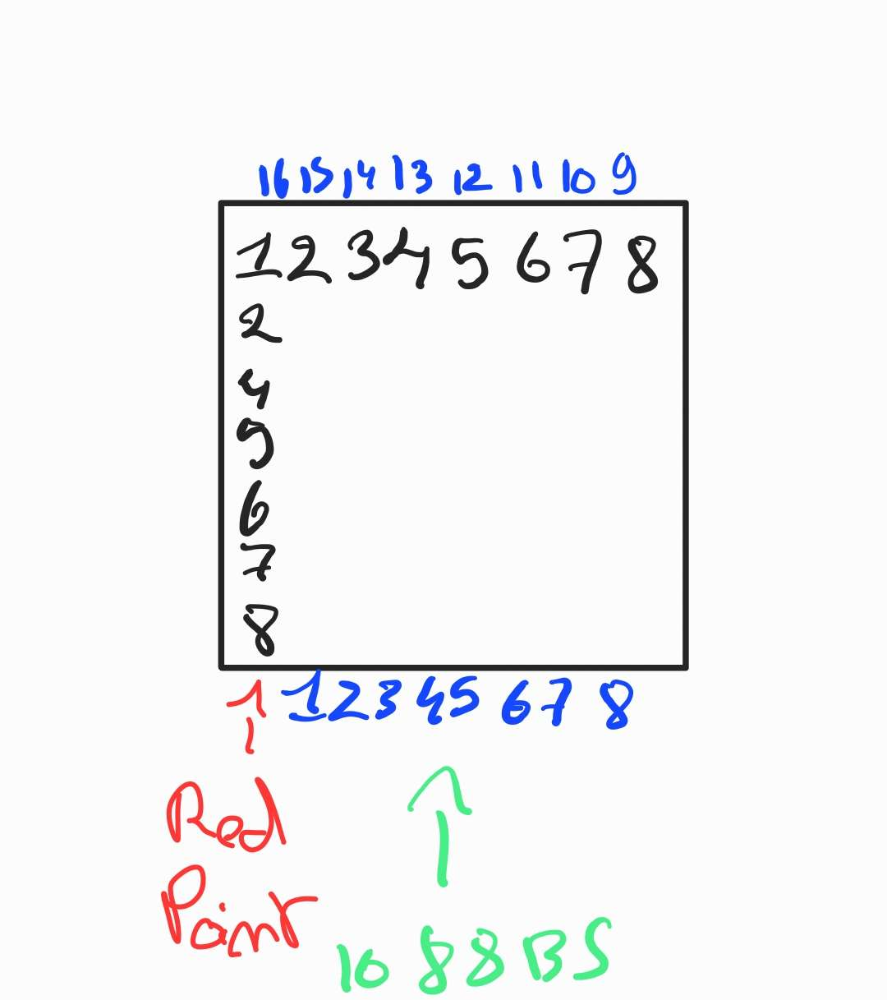

# Arduino LED matrix Pin Map

| PIN of the LED matrix | Pin of the Arduino | Row or Colum |
|-------------------------|--------------------|--------------|
| 1                       | 2                  | ROW 5        |
| 2                       | 3                  | ROW 7        |
| 3                       | 4                  | COL 2        |
| 4                       | 5                  | COL 3        |
| 5                       | 6                  | ROW 8        |
| 6                       | 7                  | COL 5        |
| 7                       | 8                  | ROW 6        |
| 8                       | 9                  | ROW 3        |
| 9                       | 10                 | ROW 1        |
| 10                      | 11                 | COL 4        |
| 11                      | 14 / A0            | COL 6        |
| 12                      | 15 / A1            | ROW 4        |
| 13                      | 16 / A2            | COL 1        |
| 14                      | 17 / A3            | ROW 2        |
| 15                      | 18 / A4            | COL 7        |
| 16                      | 19 / A5            | COL 8        |

The pins are mapped this way :

- Blue : Pin of the LED matrix
- Black : Number of the ROW/COLUMN
- Red : Position of red dot on LED matrix
- Green : Position of the 1088BS Number on the Matrix

  